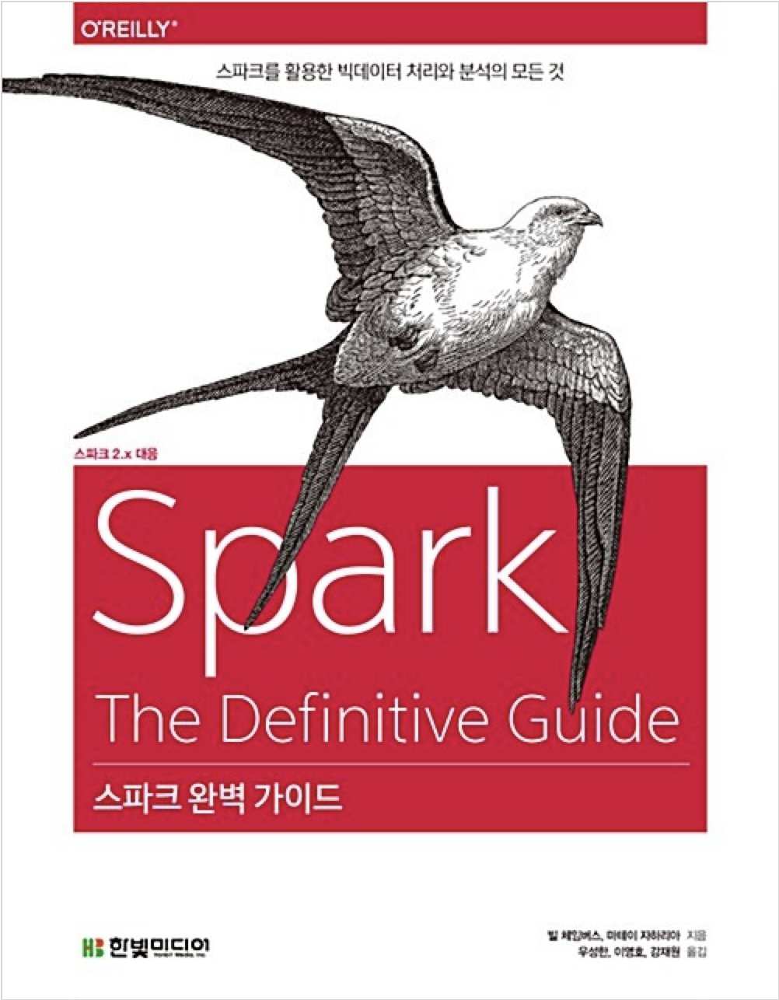

  
  <h1>스파크 완벽 가이드</h1>
  

    
    
    
  

---

## ✅ CheckLists

- [ ] 책 1회독 하기
- [ ] 실습 내용 GitHub에 남기기
- [ ] 블로그에 책 리뷰하기

---

## 👩‍💻 Study Notes

|    챕터    |                        제목                        | 공부 날짜  |
| :--------: | :------------------------------------------------: | :--------- |
|     1      |                  아파치 스파크란                   | 2022.08.27 |
|     2      |               스파크 간단히 살펴보기               |            |
|     3      |                스파크 기능 둘러보기                |            |
|     4      |                  구조적 API 개요                   |            |
|     5      |                구조적 API 기본 연산                |            |
|     6      |             다양한 데이터 타입 다루기              |            |
|     7      |                     집계 연산                      |            |
|     8      |                        조인                        |            |
|     9      |                     데이터소스                     |            |
|     10     |                     스파크 SQL                     |            |
|     11     |                      Dataset                       |            |
|     12     |                        RDD                         |            |
|     13     |                   RDD 고급 개념                    |            |
|     14     |                  분산형 공유 변수                  |            |
|     15     |            클러스터에서 스파크 실행하기            |            |
|     16     |            스파크 애플리케이션 개발하기            |            |
|     17     |                  스파크 배포 환경                  |            |
|     18     |                 모니터링과 디버깅                  |            |
|     19     |                     성능 튜닝                      |            |
|     20     |                 스트림 처리의 기초                 |            |
|     21     |               구조적 스트리밍의 기초               |            |
|     22     |            이벤트 시간과 상태 기반 처리            |            |
|     23     |          운영 환경에서의 구조적 스트리밍           |            |
|     24     |             고급 분석과 머신러닝 개요              |            |
|     25     |          데이터 전처리 및 피처 엔지니어링          |            |
|     26     |                        분류                        |            |
|     27     |                        회귀                        |            |
|     28     |                        추천                        |            |
|     29     |                    비지도 학습                     |            |
|     30     |                    그래프 분석                     |            |
|     31     |                       딥러닝                       |            |
|     32     | 언어별 특성: 파이썬(PySpark)과 R(SparkR, sparklyr) |            |
|     33     |               에코시스템과 커뮤니티                |            |
| Appendix A |                스파크 설치 및 실행                 | 2022.08.27 |
| Appendix B |   더블린 원정대: 스파크 서밋 2017 더블린 참관기    |            |
